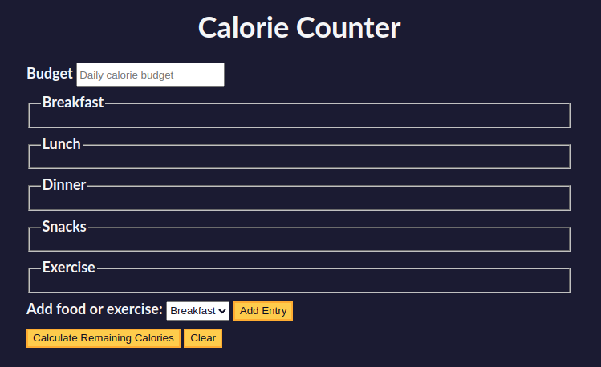

# Calories Counter

## Technologies used

Sometimes when you're coding a web application, you'll need to be able to accept input from a user. In this calorie counter project, you'll learn how to validate user input, perform calculations based on that input, and dynamically update your interface to display the results.

In this practice project, you'll learn basic regular expressions, template literals, the addEventListener() method, and more.